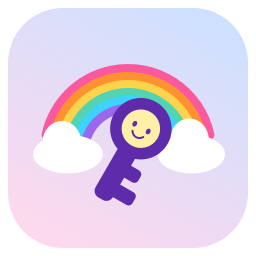
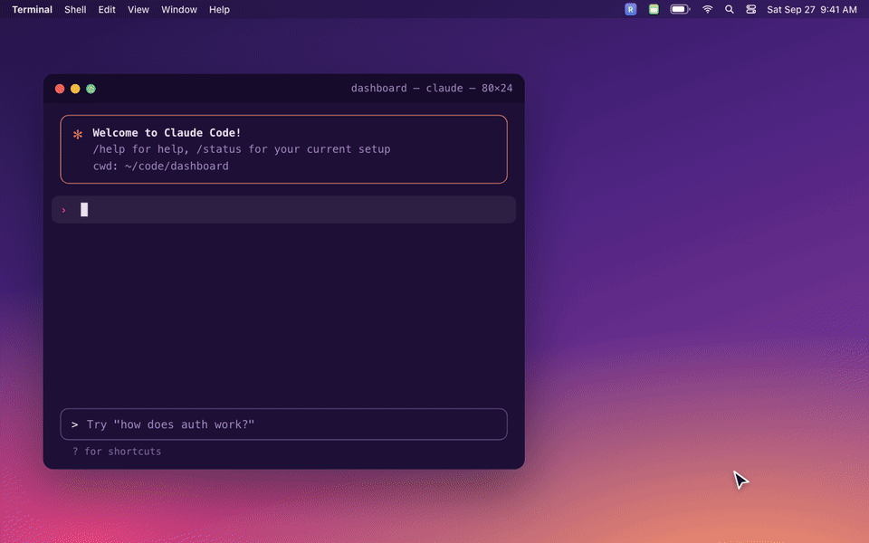
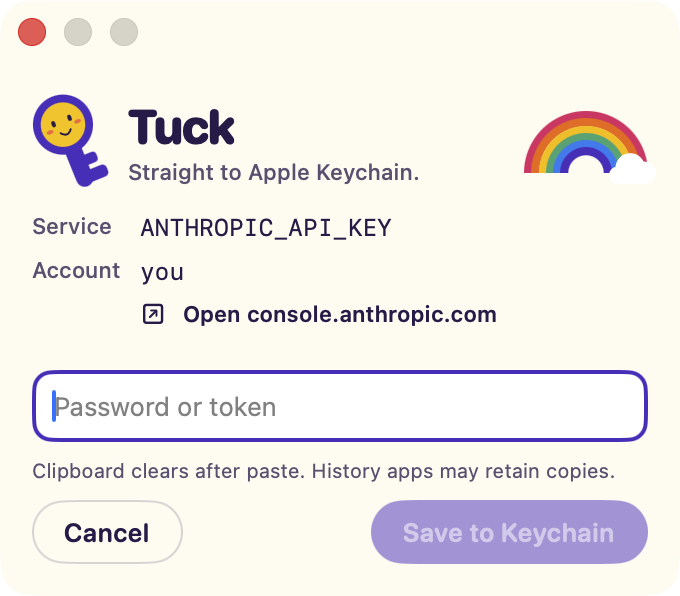
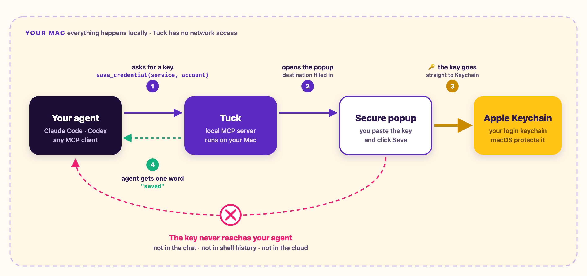

<p align="center">
  
</p>

<h1 align="center">Tuck</h1>

<p align="center">
  <b>Your agent asks. You tuck it away.</b><br>
  A native Mac app that lets your coding agent ask for an API key without the key ever entering the chat.
</p>

<p align="center">
  <a href="https://apps.apple.com/app/id6809656328"></a>
  
  
  
  <a href="LICENSE.md"></a>
</p>

<p align="center">
  
</p>

---

## The problem

Your agent needs your OpenAI key. Today it does one of two things:

- **Asks you to paste it into the chat.** Now the key sits in the transcript, the agent provider's logs, and wherever that conversation gets synced.
- **Hands you a Terminal command** like `security add-generic-password -s openai -a me -w "sk-…"`. Now the key sits in your shell history and scrollback.

Either way, a secret ends up somewhere it should never be.

## With Tuck

Your agent calls Tuck's local MCP server. A small native window opens on your Mac with the destination already filled in. You paste the key and click **Save to Keychain**. The key goes straight into Apple Keychain, your clipboard is cleared, and the agent gets back exactly one word: `saved`.

The agent never sees the key, its length, or anything derived from it.

<p align="center">
  
</p>

## How it works

<p align="center">
  
</p>

1. **Your agent asks.** It calls Tuck's one tool, `save_credential`, with where the key should go. It never sends a key.
2. **Tuck opens a popup** on your Mac with that destination already filled in.
3. **You paste the key and click Save.** It goes straight into Apple Keychain, and Tuck clears your clipboard.
4. **Your agent gets one word back:** `saved`. Never the key, its length, or anything derived from it.

Tuck's MCP server is **local**: it runs inside the Tuck app on your Mac, started by your agent's client. There is no Tuck server anywhere else.

### Using the key later

Tuck only stores the key. When a tool needs it, the tool reads it straight from Keychain. Tools that already use Keychain need nothing extra. For everything else, macOS's built-in `security` command can hand the key directly to the tool, so it never appears on screen:

```sh
# Read the key from Keychain and pass it straight into Vercel's prompt
security find-generic-password -s OPENAI_API_KEY -a me -w \
  | vercel env add OPENAI_API_KEY production
```

## What the agent can and can't do

| The agent can | The agent can't |
|---|---|
| Ask you to save a secret to a named Keychain service and account | Pass a secret in any argument (unknown fields are rejected) |
| Suggest the provider's key page, shown as a link only you can click | Read, list, export or delete any Keychain item (no such tool exists) |
| Learn the outcome: `saved`, `cancelled`, `timed_out`, `busy` or `restart_required` | See the value, its length, or a hint about it |
| | Replace an existing item without your second, explicit click |
| | Make Tuck open a web page or reach the network |

## Security model

| Tuck protects against | Tuck does not protect against |
|---|---|
| Secrets in agent transcripts and provider logs | Malware already running as you on your Mac |
| Secrets in shell history and terminal scrollback | Clipboard-history apps that captured the key before Tuck cleared the clipboard |
| An agent quietly reading your saved keys back | Another app you approve in the macOS Keychain prompt |
| Silent overwrites of an existing key | Pasting the wrong key (Tuck warns when a key looks like a different provider than its destination, but never blocks) |
| A malicious "go here to get your key" link: HTTPS only, hostname shown, never auto-opened | Anything after the key leaves Keychain for the tool that uses it |

The full design, including transport limits and failure handling, is in [ARCHITECTURE.md](ARCHITECTURE.md).

### Verify it yourself

Tuck's only entitlement is the App Sandbox. It has no network access at all:

```sh
codesign -d --entitlements - /Applications/Tuck.app
```

The whole local MCP surface is one tool, declared in [`Sources/MCPService.swift`](Sources/MCPService.swift). Keychain access is two calls, in [`Sources/KeychainWriter.swift`](Sources/KeychainWriter.swift).

## Built with care

- **Strict MCP surface.** One tool with a closed JSON schema (`additionalProperties: false`). Errors never echo the input.
- **Hardened transport.** A custom stdio transport caps each frame at 16 KiB and the queue at 8 frames, and rejects JSON-RPC batches before they reach the SDK.
- **Update-safe.** If the app is updated while an agent session is running, Tuck answers `restart_required` instead of failing a Keychain write mid-save.
- **Key-format hints.** 170 patterns generated from open-source secret scanners (gitleaks, trufflehog, secrets-patterns-db). They label the key ("Looks like an Anthropic API key"), count characters, flag stray whitespace, and warn when a key doesn't match its destination. Everything runs on-device and is advisory only.
- **Clipboard hygiene.** The clipboard is cleared after a paste into the secure field, but only if you haven't copied something newer since.
- **Respects your Mac.** Reduce Motion, VoiceOver labels, keyboard paste and menu paste all work.

## Get started

1. Install Tuck from the [Mac App Store](https://apps.apple.com/app/id6809656328). It's free and needs macOS 14 or later.
2. Open Tuck and click **Connect your agent → Copy instructions for my agent**.
3. Paste the instructions into your agent (Claude Code, Codex CLI, or any MCP client that can launch a local stdio server). It registers the server and installs the Tuck skill, which tells the agent to use Tuck for every secret you supply.
4. Restart the agent. Next time it needs a key, Tuck opens.

Prefer to configure it by hand? Add this server:

```json
{
  "mcpServers": {
    "tuck": {
      "command": "/Applications/Tuck.app/Contents/MacOS/Tuck",
      "args": ["--mcp"]
    }
  }
}
```

Then install the skill from [tuckaway.dev/skill/SKILL.md](https://tuckaway.dev/skill/SKILL.md).

## The tool

```text
save_credential
  service       string, required, 1–200 chars   Keychain service name the consumer expects
  account       string, required, 1–200 chars   Keychain account name the consumer expects
  provider_url  string, optional, HTTPS         the provider's page for creating this key
→ status: saved | cancelled | timed_out | busy | restart_required
```

## Build from source

You need Xcode 16 or later and [XcodeGen](https://github.com/yonaskolb/XcodeGen).

```sh
xcodegen generate
open Tuck.xcodeproj
```

Set your own team in `project.yml` (`DEVELOPMENT_TEAM`) or in Xcode's Signing settings. Keychain writes need a signed build.

```sh
# unit tests (includes real Keychain round-trips with synthetic values, cleaned up afterwards)
xcodebuild test -scheme Tuck -destination 'platform=macOS' -only-testing:TuckTests

# protocol tests against a built app
python3 Tests/Integration/mcp_protocol.py <path to Tuck.app>/Contents/MacOS/Tuck
```

The UI tests and `Tests/Integration/mcp_ui.py` drive real windows. They need Accessibility permission and an idle Mac.

## Repository layout

| Path | What's there |
|---|---|
| `Sources/` | The app: local MCP server, transport, popup, Keychain writer |
| `Resources/` | Info.plist, entitlements, privacy manifest, the bundled agent skill, icon |
| `Tests/Unit`, `Tests/UI`, `Tests/Integration` | XCTest suites and Python protocol and UI drivers |
| `scripts/keyformats/` | Generates `KeyFormats.swift` from open-source scanner rules |
| `project.yml` | XcodeGen spec (the checked-in `Tuck.xcodeproj` is generated from it) |

## Contributing

Issues and pull requests are welcome. Never put a real key, token or password in an issue, test, fixture or log; use obviously fake values.

Found a security problem? Please email **chris@outergy.com** rather than opening a public issue.

## License

Tuck is **fair source** under the [Functional Source License, Version 1.1, ALv2 Future License](LICENSE.md). You can read, run, modify and share it for anything except building a competing commercial product. Each release becomes Apache 2.0 two years after it ships.

Third-party notices: [Resources/ThirdPartyNotices.txt](Resources/ThirdPartyNotices.txt).

<p align="center">Made by <a href="https://outergy.com">Outergy</a> · <a href="https://tuckaway.dev">tuckaway.dev</a></p>
